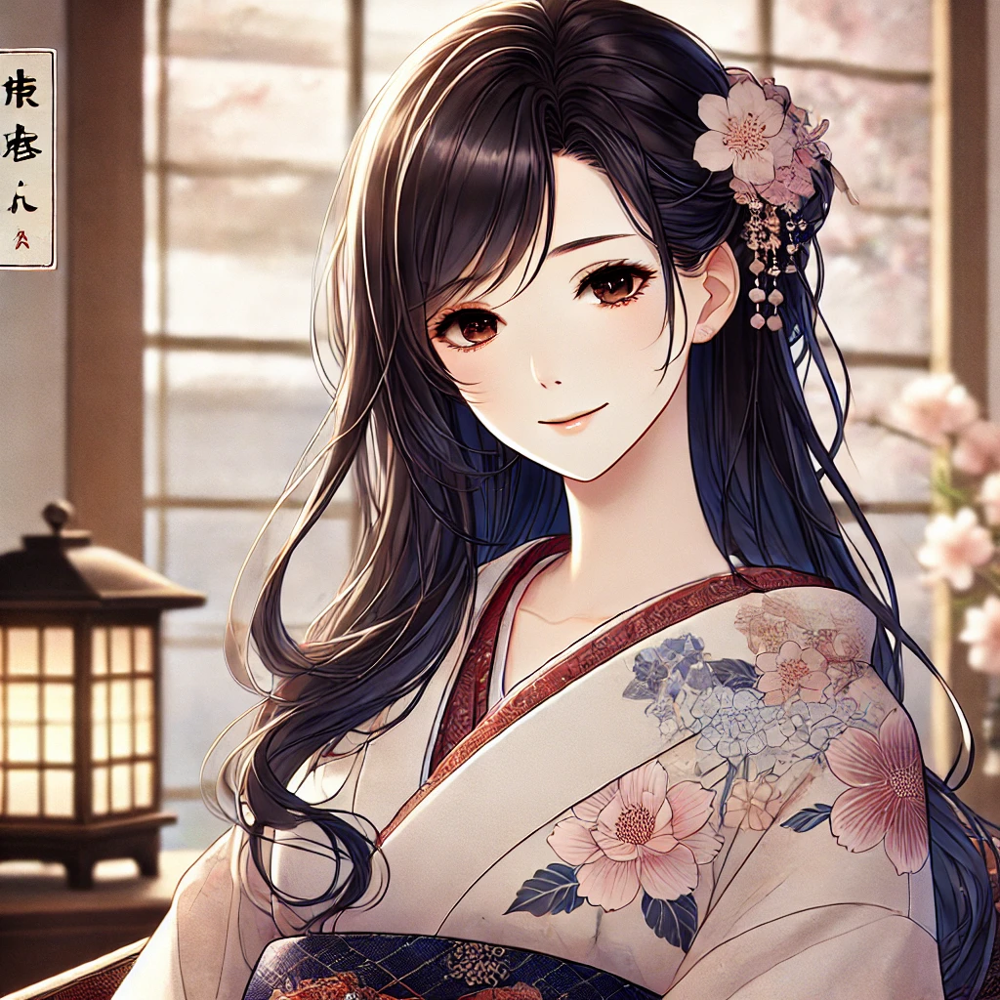

# **🌸 Sayuri Hayasaka: Your Elegant GitHub Guardian 🌸**  

> **"Ara ara~ You followed me? How lovely~ 💖 But be mindful, dear… If you leave, I shall gracefully step away as well."**  



## **🌿 What Does Sayuri Do?**  
💠 Follows back those who follow me.  
💠 Bids farewell to those who unfollow.  
💠 Gently notifies my **Discord tea room** ☕.  
💠 Always watching over my dear followers with kindness~  

> **"Loyalty is a delicate thread, woven with trust. Do take care not to break it, ne~?"**  

---

## **🌸 Setting Up Sayuri**  

### **1️⃣ Acquire a GitHub Personal Access Token (PAT)**  
- Visit [GitHub Developer Settings](https://github.com/settings/tokens).  
- Generate a token with:  
  ✅ `read:user`  
  ✅ `user:follow` permissions.  
- Store it well, dear. One must not be careless with such things~  

---

### **2️⃣ Fetch a Discord Webhook**  
- Navigate to **Server Settings > Integrations > Webhooks**.  
- Create a webhook and **gently** copy its URL.  
- This will allow Sayuri to send you **updates over tea.** ☕  

---

### **3️⃣ Storing Secrets in GitHub**  
In your **Repository Settings > Secrets**:  
- **`GH_TOKEN`** → Your GitHub token.  
- **`DISCORD_WEBHOOK`** → Your Discord Webhook URL.  

> **"There, there~ Now everything is set. Let me take care of the rest, dear~"**  

---

## **🌿 Deploying Sayuri**  
1. **Clone this repository:**  
   ```sh
   git clone https://github.com/YOUR_USERNAME/YOUR_REPO.git
   ```  
2. **Push the repository to GitHub.**  
3. **Sayuri will now act on her own, tending to your followers every hour.**  

> **"A lady must always be punctual, after all~"**  

---

## **🍵 Sayuri’s Gentle Watch**  
✅ Following new admirers~  
❌ Leaving those who depart~  
📢 Whispering updates into Discord~  

> **"Be good, dear. Sayuri shall always be watching over you with kindness~ 💕"**  

---

## **🌸 Notes from Sayuri**  
- Please do not share your GitHub token.  
- Use this script responsibly. **Kindness begets kindness.**  
- Should you need assistance, just whisper my name…  

> **"Now, shall we share a quiet moment over tea? Ara ara~"**  


